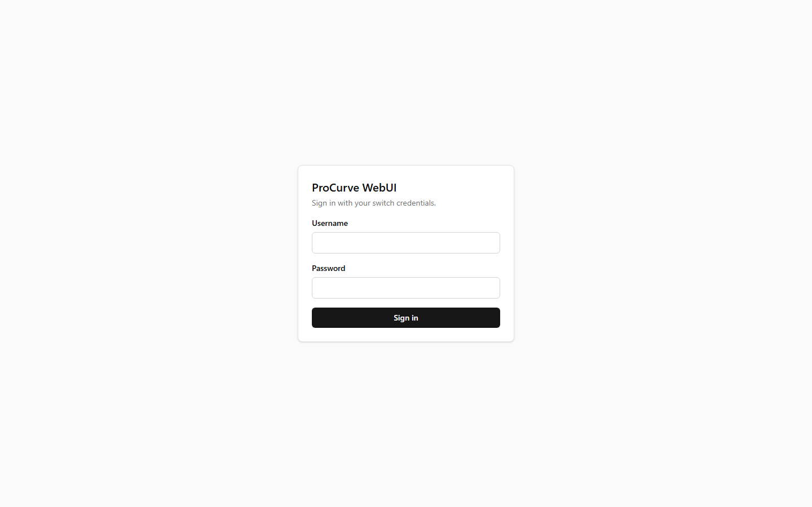
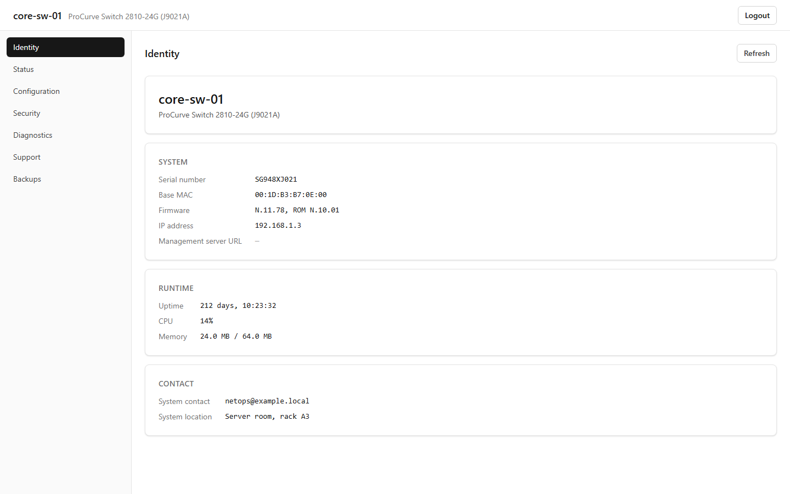
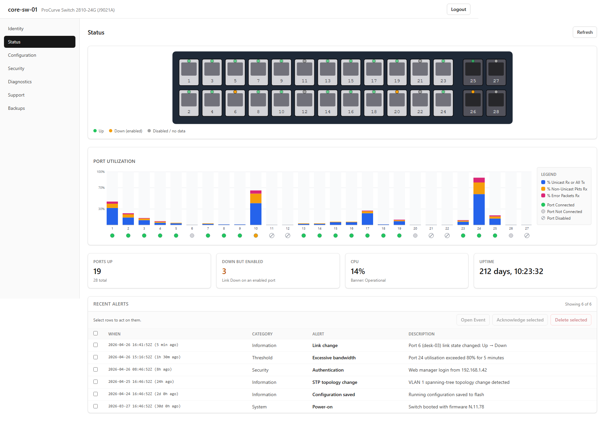
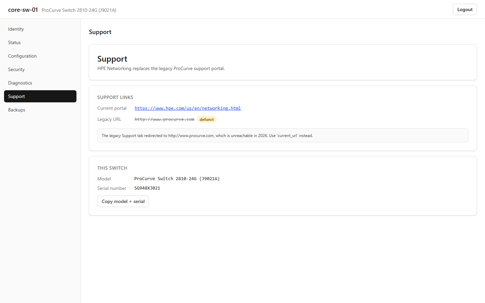
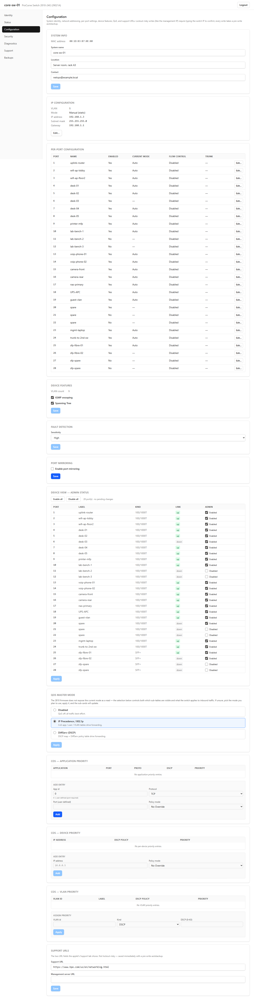
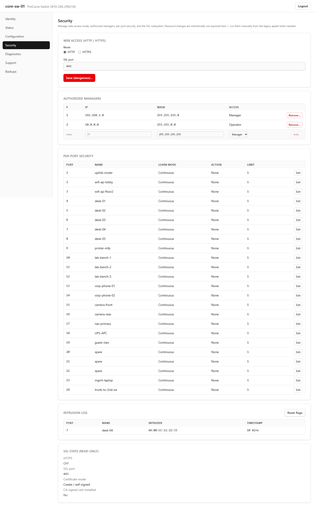
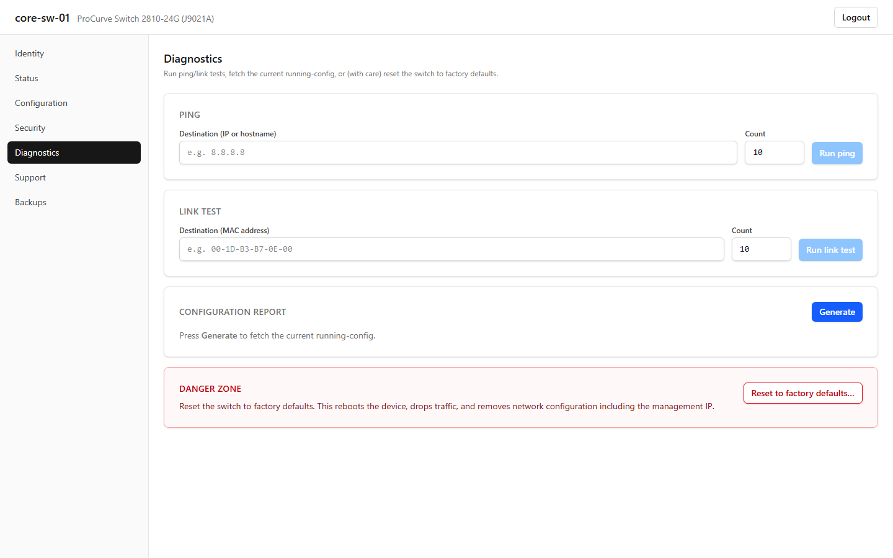
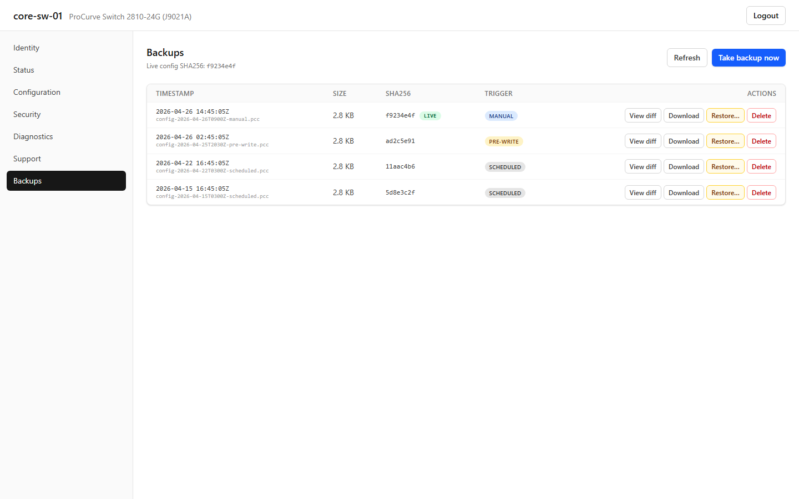

# procurve-webui

A modern, browser-native web UI for the **HP ProCurve Switch 2810-24G (J9021A)**
— and a clean rewrite of the protocol the original Java applet spoke. The
factory web UI shipped on these switches relies on a Java applet (`agent.jar`)
that no longer runs in any current browser. This project replaces it with a
single Docker container: a typed Python protocol client, a FastAPI service,
and a React SPA — all without ever touching the legacy Java stack.

> **Status:** Phase 3 — write-capable Configuration/Security/Diagnostics
> tabs, live Status overview with WebSocket port-traffic gauges, and a
> Backups manager. The original Java applet is **not** required at any point.

---

## Why this exists

The HP ProCurve 2810-24G is an excellent piece of hardware that's still
perfectly serviceable as a managed gigabit switch in homes, labs, and small
offices. Unfortunately, its management UI ages badly:

- The web UI is delivered as a Java applet (`agent.jar`, ~183 KB). Modern
  browsers removed Java applet support years ago — Chrome dropped NPAPI in
  2015, Firefox in 2017, Edge never supported it.
- Installing legacy Java just to talk to a switch is a security and
  maintenance liability.
- The CLI (telnet/SSH) is fine, but most users want a GUI for day-to-day
  monitoring and ad-hoc port changes.

`procurve-webui` lets you keep the hardware and throw away the applet.
You run **one** container on any host that can reach the switch, browse to
`http://localhost:8080`, log in with the same credentials the switch already
expects, and you get a fast, modern UI.

---

## Screenshots

> The screenshots below were captured from the running container against a
> mock backend that serves canned switch responses, so they reflect what new
> users will see on first launch (no real data leaked).

| | |
|---|---|
|  |  |
| **Login** — switch credentials only; no separate user database. | **Identity** — system name, model, firmware, uptime, MAC, memory & CPU. |
|  |  |
| **Status** — live switch render with per-port LEDs, port-utilisation chart, alert log with ack/delete. | **Support** — replaces the legacy `procurve.com` redirect with the modern HPE portal, plus copy-paste model+serial for support cases. |
|  |  |
| **Configuration** — IP, ports, device features, fault detection, monitoring, QoS. | **Security** — web access, web managers, per-port security, intrusion log, SSL state. |
|  |  |
| **Diagnostics** — ping, link test, configuration report, device reset. | **Backups** — list, diff vs live, download `.pcc`, restore, take new snapshot. |

If a screenshot is missing, see [Generating screenshots locally](#generating-screenshots-locally)
below — the `tools/mock_demo/` package bundles a one-command demo backend.

---

## Highlights

- **No Java, ever.** Pure HTTP between the container and the switch.
- **Single container deploy.** `docker compose up -d` and you're done.
- **Read-only by default.** `READ_ONLY=true` ships in `.env.example`; write
  endpoints raise `403 WriteDisabledError` until you explicitly opt in.
- **Auto-backup before every write.** A `.pcc` snapshot of the running
  configuration is captured before any state-changing operation.
- **Switch is the identity provider.** No app-side user database; the UI's
  login form validates credentials against the switch itself.
- **Type-safe end-to-end.** Pydantic v2 models on the backend, OpenAPI →
  TypeScript types on the frontend. No hand-written API types.
- **Polite to the hardware.** Polling cadence is intentionally low (default
  2 seconds for live gauges, paused when the tab is hidden); the 2810-24G
  has a small management CPU and high-frequency probes can crash it.
- **Open documentation.** Every reverse-engineered switch endpoint has its
  own `research/protocol/<tab>/<operation>.md` describing URL, query string,
  response shape, and validation rules.

---

## Hardware support

| | |
|---|---|
| **Confirmed working** | HP ProCurve Switch 2810-24G (J9021A), firmware **N.11.78** |
| **Likely working** | Other 2810-series (2810-48G / J9022A) running the same firmware family — same applet, same CGI surface. **Untested** — please open an issue with the result. |
| **Not supported** | 2510, 2610, 2810-Plus (J9573A / J9574A) — these run different firmware lines (e.g. K.x, R.x) with a different management protocol. |
| **Will not be supported** | Any switch that exposes `agent.jar` from a different vendor / firmware family. |

If you successfully run this against any other ProCurve hardware, a PR
adding a row to this table is very welcome.

---

## Quick start

### Option A — Docker (recommended)

```bash
git clone https://github.com/<your-fork>/procurve-webui.git
cd procurve-webui
cp .env.example .env

# Edit .env — at minimum set SWITCH_HOST and a real SESSION_SECRET.
# Generate the secret with:
python -c "import secrets; print(secrets.token_urlsafe(32))"

docker compose up -d
```

Browse to `http://localhost:8080`, log in with your switch credentials
(blank/blank works on factory firmware). The compose file binds to
`127.0.0.1` only by default; change `ports:` in `docker-compose.yml` if
you need LAN access (read the [security note](#security-considerations)
first).

### Option B — Local development

```bash
# Backend
cd backend
python -m venv .venv
source .venv/Scripts/activate          # Git Bash / WSL on Windows
pip install -e ".[dev]"
uvicorn app.main:app --reload --port 8080

# Frontend (separate terminal)
cd frontend
npm install
npm run dev                            # Vite on http://localhost:5173,
                                       # proxies /api/v1 → 8080
```

The development frontend talks to the local backend, which talks to the
real switch defined in `.env`. Set `READ_ONLY=true` until you trust the
write paths in your environment.

---

## Configuration (`.env`)

| Variable | Required | Default | Description |
|---|---|---|---|
| `SWITCH_HOST` | yes | — | IP or hostname of the ProCurve switch. |
| `SWITCH_PORT` | no | `80` | Switch management port (HTTP). |
| `SESSION_SECRET` | yes | — | ≥32-char random string for signing session cookies. Generate with `python -c "import secrets; print(secrets.token_urlsafe(32))"`. |
| `READ_ONLY` | no | `true` | When `true`, all `@WRITE` endpoints raise 403. Flip to `false` to enable Configuration / Security / Diagnostics writes. |
| `SESSION_TTL_HOURS` | no | `8` | Idle session lifetime. After this, the user must log in again. |
| `POLL_INTERVAL_SECONDS` | no | `2.0` | Live port-traffic poll cadence (WebSocket). Do not lower below 1.0 — the switch's management CPU does not cope. |
| `HOST` | no | `127.0.0.1` | Bind address for the FastAPI service. Set to `0.0.0.0` to expose on the LAN; understand the [security implications](#security-considerations) first. |
| `BACKUPS_DIR` | no | `/app/backups` | Filesystem path where `.pcc` backups are stored. The compose file mounts `./backups` here. |
| `METRICS_ENABLED` | no | `false` | Expose a Prometheus `/metrics` endpoint. |

**Switch credentials are never written to `.env`.** They are entered in the
browser at login, validated against the switch, and held only in the
backend's RAM (keyed by session cookie). Restart the container and every
session must re-authenticate.

---

## Architecture

One Docker container, three logical layers:

```
┌────────────────────────────────────────────────────────────────┐
│ Docker container: procurve-webui                               │
│                                                                │
│  ┌──────────────────────┐        ┌──────────────────────────┐  │
│  │ React 18 SPA         │   ←→   │ FastAPI                  │  │
│  │ Vite + TS + Tailwind │  HTTP  │ ┌──────────────────────┐ │  │
│  │ TanStack Router/Query│  /ws   │ │ REST + WebSocket     │ │  │
│  │ Recharts             │        │ └──────────┬───────────┘ │  │
│  │ shadcn/ui            │        │            │             │  │
│  │ (built ahead of time,│        │ ┌──────────▼───────────┐ │  │
│  │  served as static    │        │ │ procurve_client      │ │  │
│  │  assets by FastAPI)  │        │ │ (typed Python,       │ │  │
│  └──────────────────────┘        │ │  talks the switch's  │ │  │
│                                  │ │  GET-based protocol) │ │  │
│                                  │ └──────────┬───────────┘ │  │
│                                  └────────────┼─────────────┘  │
└───────────────────────────────────────────────┼────────────────┘
                                                │ HTTP/1.1
                                                ▼
                                   ┌──────────────────────────┐
                                   │ ProCurve 2810-24G        │
                                   │ ($SWITCH_HOST:80)        │
                                   │ eHTTP v2.0 management    │
                                   └──────────────────────────┘
```

### Layers in detail

- **`procurve_client/`** — pure-Python, async, fully typed (Pydantic v2)
  protocol library. One operation per applet CGI; functions take a
  `ProcurveTransport` and return validated models. **No FastAPI imports.**
  Reusable as a standalone library in scripts and notebooks.

- **`app/`** — FastAPI application. Thin layer that maps HTTP routes to
  `procurve_client` operations, handles auth/sessions, manages the
  `BackupStore`, and serves the pre-built React bundle. WebSocket endpoint
  `/ws/port-traffic` streams per-port counters.

- **`frontend/`** — React 18 + TypeScript SPA. TanStack Router for type-safe
  routes, TanStack Query for data fetching, Tailwind + shadcn/ui for
  styling, Recharts for graphs. Types are generated from the FastAPI
  `openapi.json` via `openapi-typescript` — no hand-written API types.

### Why this split?

- **`procurve_client` has no awareness of FastAPI.** You can `pip install`
  the package by itself and write scripts that talk to your switch from
  Python.
- **The frontend has no awareness of the switch.** It only knows the
  internal REST contract, which means the same UI would work over a
  different transport (e.g. a future REST proxy, an SNMP bridge, etc.).
- **The container has no awareness of credentials.** The switch is the
  identity provider; the only secret stored on disk is the cookie-signing
  key (`SESSION_SECRET`).

For the full design, see [`docs/specs/2026-04-23-procurve-webui-design.md`](docs/specs/2026-04-23-procurve-webui-design.md).

---

## Repository layout

```
procurve-webui/
├── backend/
│   ├── app/                  FastAPI routes, auth, backup store, settings
│   │   ├── api/              one router per tab (status, security, …)
│   │   ├── ws/               WebSocket endpoints (port-traffic)
│   │   └── main.py           app factory
│   ├── procurve_client/      Standalone protocol client library
│   │   ├── operations/       one module per tab; @READ / @WRITE decorators
│   │   ├── models/           Pydantic models per domain
│   │   ├── transport.py      httpx wrapper; auth, error mapping
│   │   └── parsing.py        tilde/sentinel response parsers
│   ├── tests/                unit + integration + byte-match write tests
│   └── pyproject.toml
├── frontend/
│   ├── src/
│   │   ├── api/              generated TS types + React Query hooks
│   │   ├── components/       layout shell, switch SVG, port LEDs
│   │   ├── features/         one folder per tab (identity, status, …)
│   │   ├── routes/           TanStack Router file-based routes
│   │   └── lib/              formatting, alert helpers
│   ├── openapi.json          snapshot for type generation
│   └── vite.config.ts
├── docker/
│   ├── Dockerfile            multi-stage; Node 22 → Python 3.12-slim
│   ├── entrypoint.sh
│   └── healthcheck.sh
├── docker-compose.yml        single-service convenience file
├── docs/
│   ├── specs/                design specifications per phase
│   ├── plans/                step-by-step implementation plans
│   └── screenshots/          PNGs used in this README
├── research/                 Phase 0 reverse-engineering output
│   ├── applet/agent.jar      the original Java applet
│   ├── mirror/               full HTTP mirror of the switch
│   ├── decompiled/           CFR-decompiled .java sources (gitignored)
│   ├── protocol/             one .md per CGI operation
│   ├── fixtures/             live-captured response samples
│   └── backups/              reference `.pcc` config snapshot
├── tools/
│   └── mock_demo/            mock backend for demos and screenshots
└── README.md (this file)
```

---

## How the protocol layer works

The original applet talks to the switch over a small surface of CGI
endpoints (~50 GET handlers, plus 2 POST endpoints for config download
and upload). All response bodies are plain ASCII with `~`-delimited
fields and an `OK~…` / `error~…` sentinel on the first line.

`procurve_client` mirrors that surface as a flat function API:

```python
import asyncio
from procurve_client import ProcurveTransport
from procurve_client.operations.identity import read_identity_page
from procurve_client.operations.status import get_port_status
from procurve_client.operations.backup import download_config

async def main():
    async with ProcurveTransport(host="192.0.2.3") as t:
        identity = await read_identity_page(t)
        print(identity.system_name, identity.firmware_version)

        port = await get_port_status(t, port=1)
        print(port.link_state, port.speed_mbps, port.duplex)

        cfg = await download_config(t)
        print(f"running-config: {cfg.size} bytes, sha256={cfg.sha256[:16]}…")

asyncio.run(main())
```

A few invariants that follow from the reverse-engineered protocol:

- **All operations are `async`.** A `ProcurveTransport` wraps a single
  `httpx.AsyncClient`; you create one per session and pass it to operations.
- **Reads are decorated with `@READ`, writes with `@WRITE`.** When
  `READ_ONLY=true`, every `@WRITE` short-circuits to
  `WriteDisabledError` *before* any network call.
- **Validation rules come from the switch firmware, not from us.** Every
  validator (port-name length, VLAN ID range, IP format, …) is sourced
  from the decompiled Java and cross-checked with live behaviour. If the
  switch will reject a value, the Python model rejects it first with a
  clear error.
- **Byte-for-byte fidelity for writes.** Each setter has a unit test
  asserting the produced HTTP request matches a known-good template
  derived from the decompiled applet. Spaces are encoded as `+` (the
  applet uses `URLEncoder.encode`); known typos in query keys (e.g.
  `indeces` instead of `indices`) are preserved verbatim because the
  switch firmware checks for them literally.

---

## Feature tour

### Identity tab — `/`
The static landing page. Pulls `/identity/identity.html` from the switch
and parses model, serial, firmware, base MAC, IPv4, uptime, total/free
memory, and CPU utilisation. Read-only, no writes.

### Status tab — `/status`
- Live SVG render of the switch chassis (24× copper RJ45 in 2 rows of 12,
  4 mini-GBIC slots on the right) with per-port LEDs reflecting link
  state and activity.
- Per-port utilisation chart (Recharts) refreshed via WebSocket
  `/ws/port-traffic` at the configured `POLL_INTERVAL_SECONDS`.
- Alert log with detail dialog, individual ack, batch ack, delete.
- `/status/ports/{port}` deep-link for per-port detail.

### Configuration tab — `/configuration` *(write)*
- System info (name, location, contact)
- IP configuration (DHCP / static)
- Default gateway
- Per-port configuration (admin state, name, speed/duplex, flow control)
- Device features (jumbo frames, IGMP snooping, etc.)
- Fault detection thresholds
- Monitoring (port mirror)
- "Bob" SFP/mini-GBIC port assignments
- QoS — CoS application/user-priority/VLAN-priority, DSCP, DiffServ

### Security tab — `/security` *(write)*
- Web access mode (Web/SSL/WebSSL/disabled)
- Web manager IP allow-lists (`web-managers`) — **lockout-risky**, gated
  by an extra confirm
- Per-port security (admin/learn/limit/intrusion alarm)
- Intrusion log + reset flags
- SSL state inspection
- Manager / operator passwords

### Diagnostics tab — `/diagnostics` *(write)*
- ICMP ping
- Link test (loopback)
- Configuration report (full running-config dump in human-readable form)
- Device reset / reload

### Backups tab — `/backups`
- List of stored `.pcc` files (timestamp, label, size, SHA256, trigger
  source: manual / pre-write / scheduled)
- Take a fresh snapshot now
- Diff a stored backup against the switch's live running-config
- Download as `.pcc`
- Restore (forces a reboot — gated by an explicit confirmation)
- Delete

### Support tab — `/support`
Renders the user-configurable Support URL the switch advertises (the
`set_support` write goes through Configuration → Support page). The tab
itself is a thin link-out card.

---

## Security considerations

The application is designed for a single trusted user on a trusted host
(typically the same machine that hosts the Docker daemon). Read this
section carefully before exposing it to the LAN.

- **No persistent user database.** The switch is the identity provider;
  credentials live only in browser session + backend RAM, keyed by a
  signed cookie. They are never written to disk, never logged.
- **`SESSION_SECRET` must be a real random value.** The container
  *intentionally* refuses to start with the placeholder string from
  `.env.example`. Generate a fresh value with
  `python -c "import secrets; print(secrets.token_urlsafe(32))"`.
- **Default bind is `127.0.0.1`.** The compose file binds the published
  port to `127.0.0.1:8080` so it's reachable only from the local host.
  To expose to the LAN, change to `8080:8080` in `docker-compose.yml`
  *and* add a TLS-terminating reverse proxy (Caddy / Traefik / nginx) —
  HTTPS is **not** built in yet. Without a proxy, switch credentials
  travel the wire in plaintext.
- **CSRF protection on writes.** The frontend submits a double-submit
  cookie token on every state-changing request; same-origin only, strict
  CORS.
- **Read-only by default.** Even with valid credentials, a fresh install
  refuses every write. Set `READ_ONLY=false` in `.env` to opt in.
- **Auto-backup before every write.** A `.pcc` snapshot is captured
  before any `@WRITE` runs; the resulting `BackupMeta` records the SHA256
  and a `pre-write` trigger label.
- **Lockout-risky operations are gated.** Changing the management IP,
  the web-managers allow-list, or the manager password requires the user
  to retype the new value as a confirmation before the call is issued.
- **Dangerous operations are out of scope.** Firmware uploads, factory
  reset, and any operation that could brick the switch are deliberately
  not exposed. They live in the future-work list and will require their
  own UX spec.

---

## Generating screenshots locally

The screenshots in this README are produced from a small mock backend
that ships with the repo, so contributors can rebuild them without
needing access to a real switch.

```bash
# 1. Build the frontend
cd frontend && npm install && npm run build

# 2. Run the demo backend (serves the dist/ + canned switch responses)
cd ../tools/mock_demo
python demo_server.py            # listens on http://127.0.0.1:8080

# 3. Browse to http://127.0.0.1:8080 and take screenshots manually,
#    or run the headless capture script:
python capture_screenshots.py    # writes PNGs to docs/screenshots/
```

The mock backend serves hardcoded fixtures — it never opens a TCP
connection to the switch — so it's safe to run on any host.

---

## Development

### Running the test suite

```bash
cd backend
pytest                            # unit + parser + write-template tests
pytest -m live                    # live read-only against the configured switch
pytest -m roundtrip               # opt-in: write → verify → restore loop
                                  # (requires user approval; never run in CI)
```

`live` and `roundtrip` are **not** run by CI. They require an actual
switch and credentials, and `roundtrip` will perform a write before
restoring the reference baseline. Coverage target for `procurve_client/`
is ≥90%.

### Linting and type-checking

```bash
cd backend
ruff check .
mypy .

cd ../frontend
npm run lint
npm run typecheck
```

### Regenerating the OpenAPI types

When you add or change a backend endpoint:

```bash
# Backend running locally on :8080
curl http://localhost:8080/openapi.json > frontend/openapi.json

cd frontend
npm run gen:api                   # writes src/api/schema.d.ts
```

### Reverse-engineering documentation

Each switch endpoint has its own protocol document under
`research/protocol/<tab>/<operation>.md`. The format is documented in
[`research/protocol/_conventions.md`](research/protocol/_conventions.md).
Live response samples are in `research/fixtures/` and are kept verbatim
(no normalisation) so write-template byte-match tests can rely on them.

---

## Roadmap

Implemented:

- [x] Phase 0 — JAR decompilation, asset mirror, protocol docs, fixtures
- [x] Phase 1 — Python `procurve_client` library (read + write, ≥90% cov.)
- [x] Phase 2 — Docker scaffold, read-only Identity + Status UI, WebSocket port traffic
- [x] Phase 3 — Configuration / Security / Diagnostics tabs (write), Backups tab, alert ack/delete

Planned:

- [ ] HTTPS via a Caddy sidecar (self-signed by default, swap-in for ACME)
- [ ] "Dangerous-tier" operations (firmware upload, factory reset) with their own UX spec
- [ ] Multi-switch dashboard
- [ ] Optional remember-me long-lived token
- [ ] SNMP bridge mode (read-only) so the same UI works against switches without the eHTTP service exposed

If you'd like to help with any of these, see [Contributing](#contributing).

---

## Contributing

Issues and pull requests are welcome. A few ground rules to keep this
project safe to use against real production switches:

1. **Never increase poll cadence below 1 second.** The 2810's management
   CPU has been observed to crash under high-frequency probing; the
   current 2-second default is conservative for a reason.
2. **Every new `@WRITE` operation must ship with:**
   - A protocol doc under `research/protocol/<tab>/`
   - A byte-match unit test
   - A safety level (`normal` / `careful` / `dangerous`)
   - A docs entry under [Feature tour](#feature-tour)
3. **No live tests in CI.** Live-switch tests are useful locally, but CI
   must be runnable on a clean host with no hardware.
4. **Run `ruff`, `mypy`, and the frontend's `lint`/`typecheck` before
   sending a PR.** The repo aims for zero new warnings.
5. **If you change anything in `procurve_client`**, regenerate
   `frontend/openapi.json` and the TS types.

For substantive features, please open a discussion or design issue first
— larger changes are easier to land when the design is agreed up front.
The design docs under `docs/specs/` are good models for the level of
detail expected.

---

## License

Released under the MIT License. See [`LICENSE`](LICENSE) for the full
text.

> **Disclaimer.** "HP", "ProCurve", and "2810-24G" are trademarks of
> Hewlett Packard Enterprise. This project is **not affiliated with,
> endorsed by, or sponsored by HPE**. It is an independent, clean-room
> reimplementation of the management protocol the switch's stock firmware
> already exposes, written for owners of legacy hardware who can no
> longer use the bundled Java applet. Use at your own risk; the authors
> take no responsibility for misconfigured or bricked equipment.

---

## Acknowledgements

- The community keeping legacy ProCurve hardware alive on forums and
  reddit threads — especially for confirming that the eHTTP v2 protocol
  is consistent across the 2810 firmware family.
- [CFR](https://www.benf.org/other/cfr/) — the Java decompiler used to
  read `agent.jar`. Phase 0 would have been much harder without it.
- [FastAPI](https://fastapi.tiangolo.com/), [TanStack
  Router/Query](https://tanstack.com/), [shadcn/ui](https://ui.shadcn.com/),
  and [Recharts](https://recharts.org/) — every layer of the stack that
  made it possible to build a polished UI in a sane amount of time.
